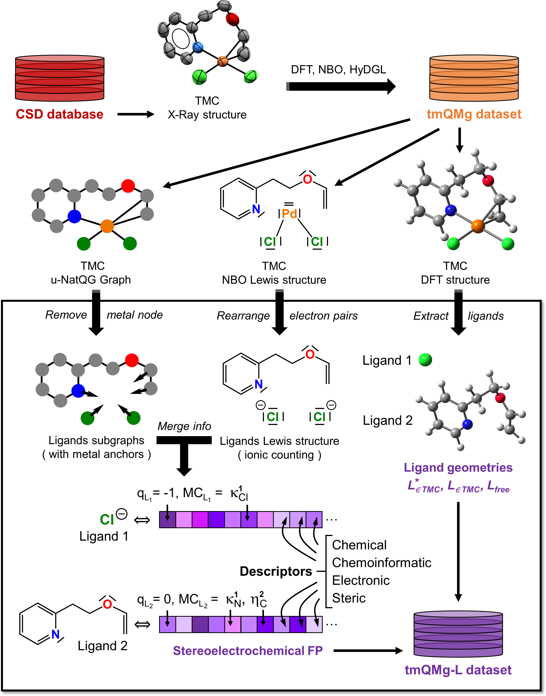

# tmQMg-L

This repository contains the data files of the ligands dataset tmQMg-L containing 30k ligands extracted from the Cambridge Structural Database. The ligands come with their atomic positions, metal-coordinating atom indices and corresponding formal charges. Electronic, steric and cheminformatics descriptors have been calculated for each ligand and are included as well. Details on how the data was compiled can be found in the corresponding publication [Directional Multiobjective Optimization of Metal Complexes at the Billion-Scale with the tmQMg-L Dataset and PL-MOGA Algorithm](https://chemrxiv.org/engage/chemrxiv/article-details/651051d4ed7d0eccc32252ea).

## Data

###### [ligands_misc_info.csv](ligands_misc_info.csv)
- The main ligand file containing information about occurrence, IDs and metal-coordinating atom indices.

###### [ligands_fingerprints.csv](ligands_fingerprints.csv)
- The ligand fingerprints containing information such as the charge, number of atoms and coordination mode.

###### [ligands_descriptors.csv](ligands_descriptors.csv)
- The calculated RDKit, steric and electronic descriptors.

###### [stable.csv](stable.csv)
- List of all ligands and their most stable occurrence.

###### [xyz/](xyz/)
- Directory containing the geometries of all ligands ([xyz/ligands_xyzs.xyz](xyz/ligands_xyzs.xyz)), only the stable ligands ([xyz/ligands_stable_xyzs.xyz](xyz/ligands_stable_xyzs.xyz)) and the optimised stable ligands ([xyz/ligands_stable_xyzs_opt.xyz](xyz/ligands_stable_xyzs_opt.xyz)).

###### [descriptors/](descriptors/)
- Directory containing the RDKit, steric and electronic descriptors in separate files and the scripts to create them. Furthermore, a script to merge them into one.
---

[![CC BY NC 4.0][cc-by-nc-image]][cc-by-nc]

This work is licensed under a
[Creative Commons Attribution-NonCommercial 4.0 International License][cc-by-nc].

[cc-by-nc]: http://creativecommons.org/licenses/by-nc/4.0/
[cc-by-nc-image]: https://i.creativecommons.org/l/by-nc/4.0/88x31.png
